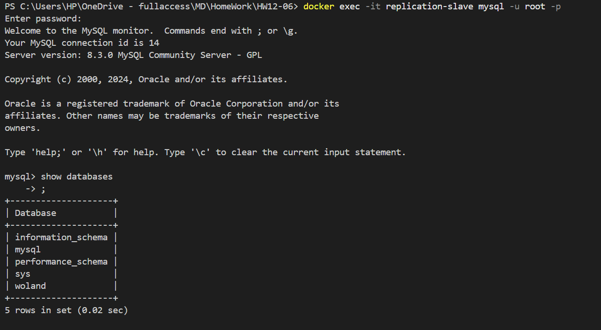

# Домашнее задание к занятию "`Репликация и масштабирование. Часть 1`" - `Барышков Михаил`

### Задание 1

На лекции рассматривались режимы репликации master-slave, master-master, опишите их различия.

*Ответить в свободной форме.*

---

## Решение 1

### Master-Slave репликация

#### Принцип работы

- Master (главный сервер) – принимает все запросы на запись (**INSERT, UPDATE, DELETE**).

- Slave (подчинённый сервер) – получает изменения с Master и применяет их, обслуживая только чтение (**SELECT**).

#### Характеристики

- Односторонняя синхронизация – данные копируются только от Master к Slave.
- Read Scaling – можно добавлять множество Slave для распределения нагрузки на чтение.
- Резервирование – если Master упадёт, можно вручную переключиться на Slave.
- Нет автоматического failover – при падении Master требуется ручное вмешательство.
- Запись только на Master – если писать в Slave, возникнет рассинхронизация.

#### Пример использования

- Веб-приложение, где запись идёт на Master, а чтение распределяется между Slave.
- Аналитика и отчёты, которые работают с Slave, чтобы не нагружать Master.

### Master-Master (или Multi-Master) репликация

#### Принцип работы

Оба сервера (Master 1 и Master 2) принимают запись и реплицируют изменения друг другу. Изменения, сделанные на одном Master, применяются на другом.

#### Характеристики

- Двусторонняя синхронизация – можно писать в любой Master.
- Отказоустойчивость – если один Master упадёт, второй продолжит работать.
- Геораспределение – можно разместить Masters в разных дата-центрах.
- Конфликты репликации – если на обоих Masters изменить одни и те же данные, возможны коллизии.
- Сложность настройки – требуется контроль за конфликтами и задержками синхронизации.

#### Пример использования

- Глобальные приложения, где запись должна работать в разных регионах.
- Высокая доступность (High Availability, HA), когда критично минимизировать downtime.

### Какую репликацию выбрать?

- Master-Slave – если нужно масштабирование чтения и простое резервирование.
- Master-Master – если нужна высокая доступность и запись в нескольких местах.

## Задание 2

Выполните конфигурацию master-slave репликации, примером можно пользоваться из лекции.

*Приложите скриншоты конфигурации, выполнения работы: состояния и режимы работы серверов.*

---

## Решение 2

### MASTER

### SLAVE

---

## Дополнительные задания (со звёздочкой*)

Эти задания дополнительные, то есть не обязательные к выполнению, и никак не повлияют на получение вами зачёта по этому домашнему заданию. Вы можете их выполнить, если хотите глубже шире разобраться в материале.

---

## Задание 3*

Выполните конфигурацию master-master репликации. Произведите проверку.

*Приложите скриншоты конфигурации, выполнения работы: состояния и режимы работы серверов.*

---

## Решение  3
